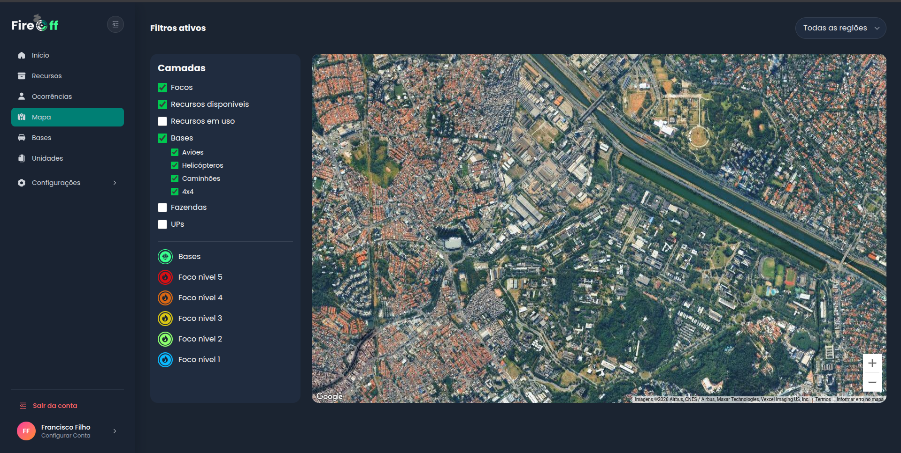

# Ponderada de teste UX

### 1. Tela(s) analisada(s)
**Print da tela:** 

**Contexto:** A tela "Mapa" do sistema FireOff exibe o monitoramento georreferenciado de focos de incêndio florestal e a disposição logística de recursos de contenção (aéreos e terrestres), alimentada por um algoritmo de fluxo máximo.

### 2. Tipo de teste
**Indicar:** Visualização e Tarefa.
**Explicação:** O teste avaliará se a visualização simultânea e a filtragem dos níveis de incêndio e recursos disponíveis no mapa permitem que o usuário interprete os dados e tome decisões logísticas rapidamente.

### 3. Conjunto de perguntas (Técnica do Funil)
* **Pergunta 1 (Topo do Funil - Exploração/Percepção):** Ao bater o olho nesta tela, qual você acredita ser o objetivo principal deste mapa e das opções no menu esquerdo?
* **Pergunta 2 (Meio do Funil - Compreensão Visual/Interação):** Se você precisasse limpar a tela e visualizar *apenas* os focos de incêndio mais críticos (Nível 5) e os helicópteros, onde você clicaria? 
* **Pergunta 3 (Fundo do Funil - Descoberta/Regras):** Como você faz para diferenciar visualmente no mapa um recurso (ex: caminhão) que está "disponível" de um que está "em uso"?
* **Pergunta 4 (Ação Final - Tarefa e Decisão):** Baseado na visualização do mapa, como você faria para identificar e enviar o recurso 4x4 mais próximo para atender a um foco de incêndio específico?

### 4. Objetivo do teste

O objetivo central é validar se a interface consegue traduzir a complexidade do algoritmo de fluxo máximo (focos vs. recursos) em uma experiência visual intuitiva para a operação. Especificamente, queremos descobrir:
* Se a carga cognitiva do menu lateral está adequada ou se há excesso de informações competindo pela atenção do usuário (checkboxes e legendas misturados).
* Se a hierarquia de cores e ícones (Foco nível 1 ao 5) comunica instantaneamente a urgência correta (ex: vermelho como mais crítico).
* Se a distinção visual entre "Recursos disponíveis" e "Recursos em uso" é clara o suficiente para evitar erros de alocação de veículos ou aeronaves que já estão ocupados.
* A facilidade com que o usuário consegue cruzar dados espaciais (ex: avaliar a distância entre um foco crítico e a base com o recurso adequado mais próximo).

### 5. Ação ou entendimento esperado
**O que o usuário deve conseguir fazer ou compreender:**
Para que a interface cumpra seu papel, os seguintes comportamentos e entendimentos são esperados como critério de sucesso:
* **Compreensão do Modelo Mental:** O usuário deve reconhecer o painel esquerdo imediatamente como sua central de filtros e controle, entendendo a relação direta entre o que está marcado na barra e o que é plot